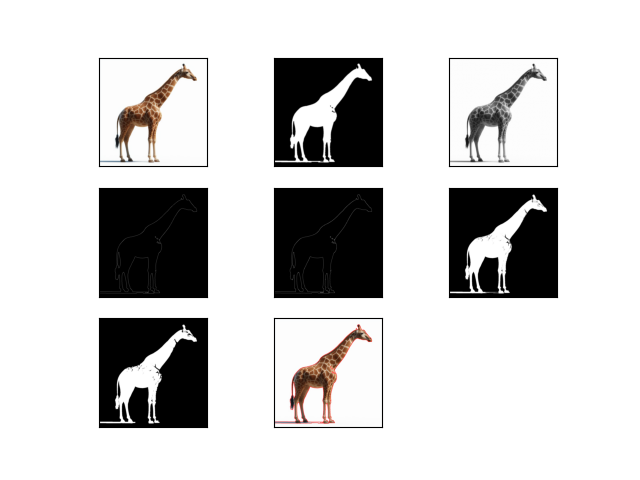
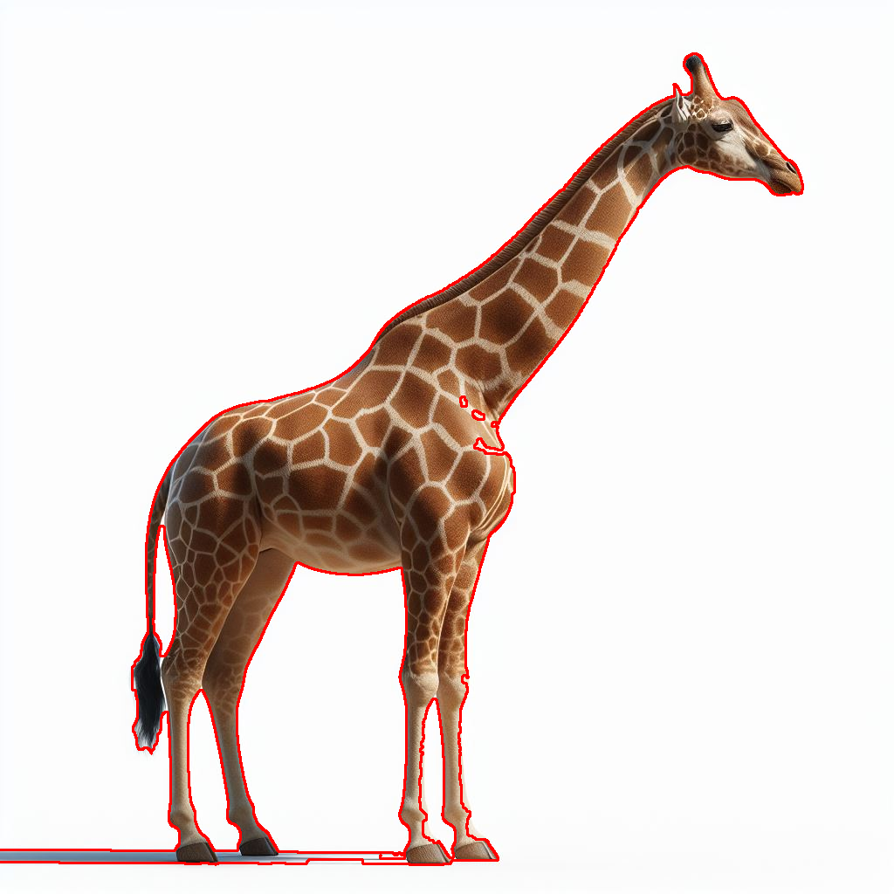
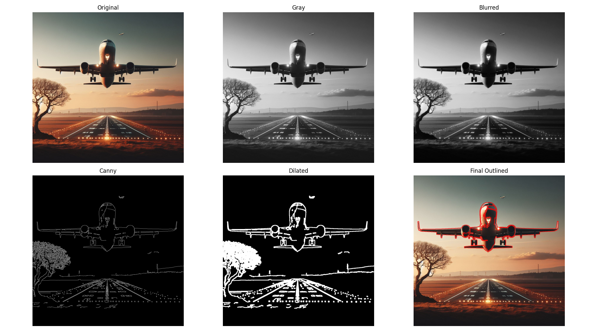
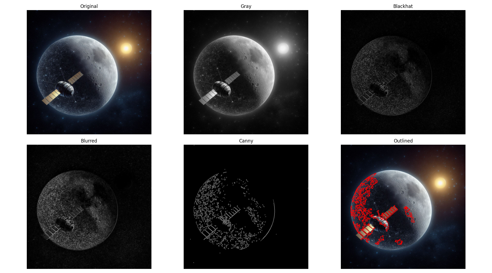
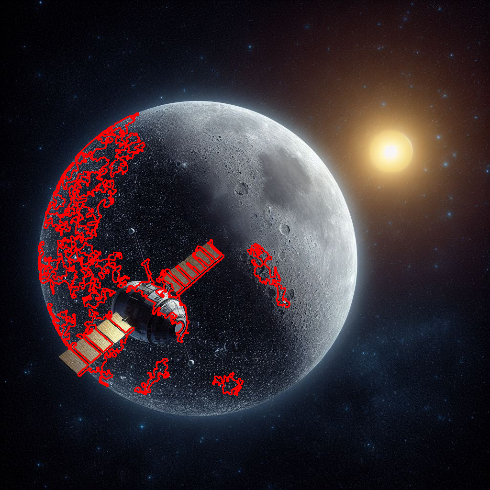

# CC7711-Lab6

## Girafa

1. Leitura da Imagem e Conversão para RGB

    img = cv2.imread('./imagens/GIRAFA.jpeg')
    img = cv2.cvtColor(img, cv2.COLOR_BGR2RGB)

- A imagem é carregada do arquivo (GIRAFA.jpeg) usando cv2.imread().
- A imagem é convertida para rgb

2. Conversão para Escala de Cinza

    img_gray = cv2.cvtColor(img, cv2.COLOR_RGB2GRAY)

- A imagem é convertida para escala de cinza (grayscale) usando cv2.cvtColor().

3. Limitação de Valor e Criação da Imagem Binária

    a = img_gray.max()
    _, thresh = cv2.threshold(img_gray, a/2*1.7, a, cv2.THRESH_BINARY_INV)

- O valor máximo do pixel da imagem em escala de cinza é armazenado na variável a.
- cv2.threshold() é usado para aplicar um limiar de binarização. O valor do limiar é calculado como a/2*1.7. A função gera uma imagem binária onde valores acima do limiar são convertidos para preto e valores abaixo são convertidos para branco (usando o tipo cv2.THRESH_BINARY_INV).

4. Operações Morfológicas: Abertura (Opening)

    tamanhoKernel = 5
    kernel = np.ones((tamanhoKernel, tamanhoKernel), np.uint8)
    thresh_open = cv2.morphologyEx(thresh, cv2.MORPH_OPEN, kernel)

- A operação de abertura (cv2.MORPH_OPEN) é aplicada para remover pequenos ruídos. Isso é feito usando um kernel (máscara de tamanho 5x5), que realiza uma erosão seguida de dilatação.

5. Operações Morfológicas: Fechamento (Closing)

    img_close = cv2.morphologyEx(thresh, cv2.MORPH_CLOSE, kernel)

- O fechamento (cv2.MORPH_CLOSE) é a operação oposta, onde a dilatação é seguida pela erosão. Ele é usado para preencher buracos nas áreas brancas da imagem binária.

6. Aplicação de Filtro de Ruído (Blur)

    img_blur = cv2.blur(img_close, ksize=(tamanhoKernel, tamanhoKernel))

- A função cv2.blur() aplica um filtro de suavização (blur) para reduzir o ruído da imagem. O tamanho do filtro é 5x5 (definido por tamanhoKernel).

7. Detecção de Bordas com o Algoritmo de Canny (Sem Blur)

    edges_gray = cv2.Canny(image=img_close, threshold1=a/2, threshold2=a/2)

- A função cv2.Canny() é usada para detectar bordas na imagem. Aqui, o método é aplicado na imagem resultante de fechamento (sem o filtro de blur). Os parâmetros de limiar (threshold1 e threshold2) são definidos com base no valor máximo da imagem.

8. Detecção de Bordas com o Algoritmo de Canny (Com Blur)

    edges_blur = cv2.Canny(image=img_blur, threshold1=a/2, threshold2=a/2)

- A detecção de bordas é repetida após a aplicação do filtro de blur, o que pode ajudar a suavizar as bordas detectadas.

9. Encontrar Contornos na Imagem

    contours, hierarchy = cv2.findContours(image=edges_gray, mode=cv2.RETR_TREE, method=cv2.CHAIN_APPROX_SIMPLE)
    contours = sorted(contours, key=cv2.contourArea, reverse=True)
    img_copy = img.copy()
    final = cv2.drawContours(img_copy, contours, contourIdx=-1, color=(255, 0, 0), thickness=2)
    
- cv2.findContours() encontra os contornos na imagem de bordas. O modo cv2.RETR_TREE permite encontrar todos os contornos, criando uma hierarquia.
- Os contornos são classificados de acordo com a área (do maior para o menor).
- A função cv2.drawContours() é usada para desenhar todos os contornos na imagem copiada, com uma cor vermelha (RGB: 255, 0, 0) e espessura 2.

## Aviao

1. Carregamento e preparação da imagem:

    img = cv2.imread('./imagens/Aviao.jpeg')
    img_rgb = cv2.cvtColor(img, cv2.COLOR_BGR2RGB)
    img_gray = cv2.cvtColor(img_rgb, cv2.COLOR_RGB2GRAY)

- cv2.imread: Carrega a imagem do arquivo (no formato JPEG).
- cv2.cvtColor: Converte a imagem de BGR (formato padrão do OpenCV) para RGB, pois estamos usando a biblioteca matplotlib que trabalha melhor com o formato RGB.
- cv2.cvtColor: Converte a imagem RGB para escala de cinza, para facilitar o processamento de bordas e contornos.

2. Desfoque e detecção de bordas:

    img_blur = cv2.GaussianBlur(img_gray, (5, 5), 0)
    edges = cv2.Canny(img_blur, 50, 150)
    edges_dilated = cv2.dilate(edges, np.ones((5, 5), np.uint8), iterations=1)

- cv2.GaussianBlur: Aplica um desfoque gaussiano na imagem em escala de cinza para suavizar e reduzir ruídos antes de detectar bordas.
- cv2.Canny: Aplica o detector de bordas Canny. Ele detecta bordas na imagem com base nos limiares de intensidade especificados (50 e 150 neste caso).
- cv2.dilate: Dilata as bordas detectadas, aumentando sua espessura. Isso ajuda a tornar os contornos mais visíveis e sólidos, o que facilita a detecção de contornos em estágios posteriores.

3. Detecção de contornos:

    contours, _ = cv2.findContours(edges_dilated, cv2.RETR_EXTERNAL, cv2.CHAIN_APPROX_SIMPLE)

- cv2.findContours: Encontra os contornos na imagem dilatada. cv2.RETR_EXTERNAL significa que apenas os contornos externos serão considerados. cv2.CHAIN_APPROX_SIMPLE simplifica os contornos, armazenando apenas os pontos extremos de cada linha de contorno.

4. Filtragem de contornos e desenhando os contornos válidos:

    img_outlined = img_rgb.copy()
    height = img_gray.shape[0]
    min_area = 1000
    max_bottom_y = int(height * 0.6)

    for cnt in contours:
        area = cv2.contourArea(cnt)
        x, y, w, h = cv2.boundingRect(cnt)
        bottom_y = y + h
        if area > min_area and bottom_y < max_bottom_y:
            cv2.drawContours(img_outlined, [cnt], -1, (255, 0, 0), 2)

- img_outlined: Cria uma cópia da imagem original em RGB para desenhar os contornos encontrados.
- height: Obtém a altura da imagem em pixels (usada para limitar o desenho de contornos na parte superior da imagem).
- min_area: Define uma área mínima para que um contorno seja considerado. Contornos com área menor que isso são ignorados.
- max_bottom_y: Limita o desenho de contornos àqueles que se encontram acima de 60% da altura da imagem.
- cv2.boundingRect: Obtém um retângulo delimitador para cada contorno detectado, usado para calcular a posição e o tamanho.
- cv2.drawContours: Desenha os contornos que atendem aos critérios (área maior que min_area e finalizando acima de max_bottom_y), usando uma cor vermelha (255, 0, 0) e espessura de 2 pixels.

## Satelite

1. Carregamento e conversão da imagem

    img = cv2.imread('./imagens/Satelite.jpeg')
    img_rgb = cv2.cvtColor(img, cv2.COLOR_BGR2RGB)
    img_gray = cv2.cvtColor(img_rgb, cv2.COLOR_RGB2GRAY)
    cv2.imread: carrega a imagem.

- cv2.cvtColor: converte de BGR para RGB (para exibir corretamente com matplotlib) e depois para tons de - cinza, que é necessário para os filtros de borda.

2. Desfoque (Gaussian Blur)

    img_blur = cv2.GaussianBlur(img_gray, (5, 5), 0)

- Reduz ruídos e detalhes pequenos na imagem.
- Ajuda o detector de bordas (Canny) a se concentrar em contornos mais fortes e importantes.

3. Detecção de bordas com Canny

    edges = cv2.Canny(img_blur, 70, 150)

- Detecta bordas com base em variações de intensidade.
- Os valores 70 e 150 são os limiares inferior e superior: controlam a sensibilidade da detecção.

4. Dilatação das bordas 
    edges_dilated = cv2.dilate(edges, np.ones((3, 3), np.uint8), iterations=1)

- Expande as bordas detectadas, preenchendo pequenas falhas.
- Facilita a detecção de contornos mais sólidos na próxima etapa.

5. Detecção e filtragem de contornos

    contours, _ = cv2.findContours(edges_dilated, cv2.RETR_EXTERNAL, cv2.CHAIN_APPROX_SIMPLE)

- Detecta contornos baseados nas bordas dilatadas.
- RETR_EXTERNAL: pega apenas os contornos externos.
- CHAIN_APPROX_SIMPLE: simplifica os pontos do contorno.

    for cnt in contours:
        area = cv2.contourArea(cnt)
        if 1000 < area < 20000:
            cv2.drawContours(img_outlined, [cnt], -1, (255, 0, 0), 2)

- Filtra contornos por área: ignora objetos muito pequenos ou muito grandes (como a Lua).
- Desenha apenas os que estão dentro do intervalo desejado.